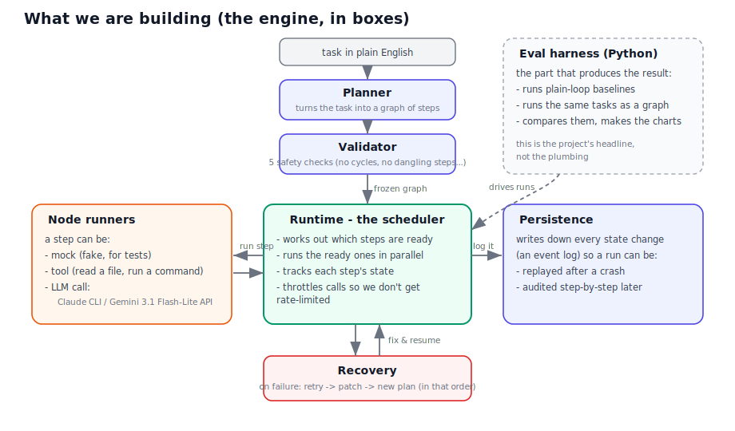
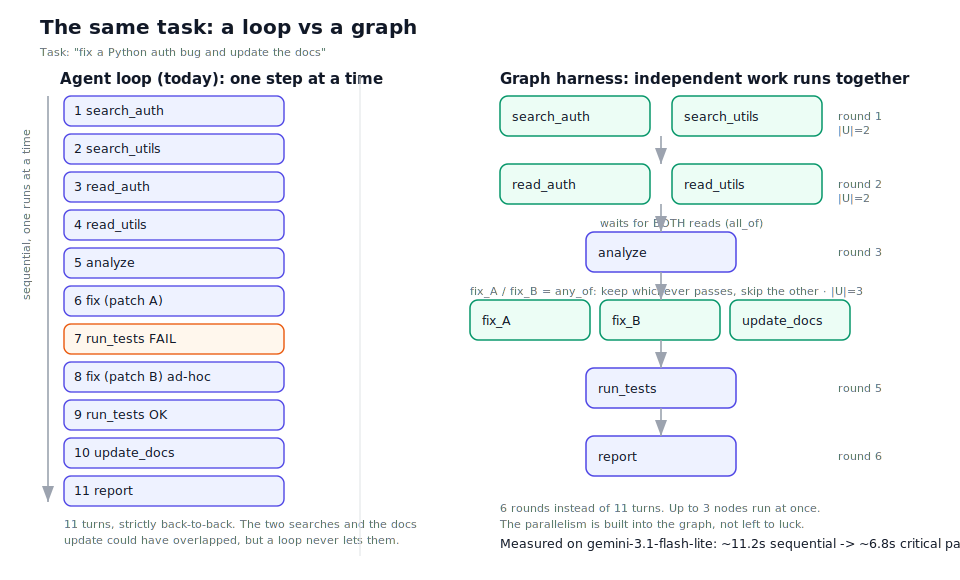
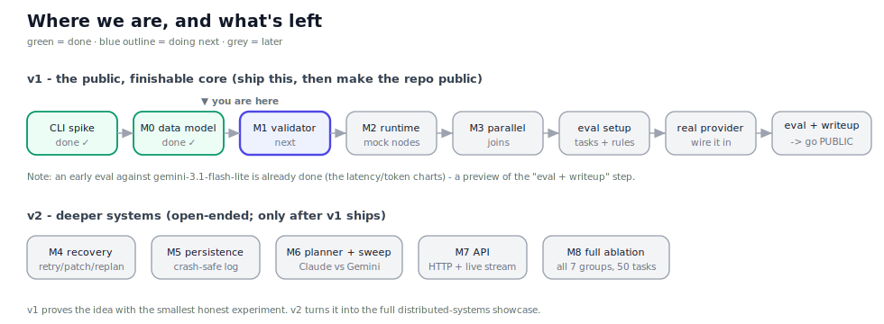

# Project Plan - Graph Harness (SGH)

> A plain-English plan. Companion: [`PAPER_EXPLAINED.md`](PAPER_EXPLAINED.md) explains the research paper this is based on.
> If you only read one thing, read section 1 and look at the two diagrams.

---

## 1. What this is, in two sentences

Most AI agents today run as a **loop**: one model looks at everything so far, picks the next single action, does it, and repeats. A recent paper (arXiv:2604.11378) argues that for serious engineering tasks you should instead lay the work out as a **graph** of steps that is planned up front and then run by a predictable scheduler - so independent steps run at the same time, dependencies are guaranteed, and failures are handled by a fixed set of rules instead of the model's whim.

The paper has **no code**. This project is the missing code: a working engine that runs those graphs, plus an experiment that measures whether the graph approach actually beats the loop. It is mostly backend and systems work (scheduling, state, persistence, failure handling) with the AI model used as the "thing that runs inside each step."

Here is the whole engine in one picture:



The single most important idea - the difference between a loop and a graph for the exact same task - looks like this:



---

## 2. Why this project suits you

- It is roughly **80% backend / systems engineering** (a scheduler, a state machine, an event log, retry logic, rate limiting, an API) and **20% AI** (the model just runs inside each step). That matches a backend-leaning profile.
- The paper hands you a build spec and an experiment design, so you are not inventing the research - you are implementing and testing it, which is exactly the kind of thing that reads well on a resume and in interviews.
- The headline result ("does the graph actually beat the loop, and by how much?") is the differentiator. The engine alone is, in the paper's own words, "Airflow for AI steps." The **experiment** is what makes it interesting.

---

## 3. What is already done

| Step | What we built | Result |
|------|---------------|--------|
| **CLI feasibility spike** | A small Go probe that hammers the Claude CLI and Gemini at the same time, demanding clean JSON back, with cancellation. | **Claude CLI: works.** Gemini **CLI: dead** on this account (auth error). **Gemini 3.1 Flash-Lite via the HTTP API: works** - 100% clean JSON, ~1s/call, real token counts. |
| **M0 - data model** | The Go types for a plan: steps, dependencies, the per-step lifecycle states, output rules. With tests on the paper's example task. | 15 tests pass, no external dependencies. |
| **Early eval** | A Python script that runs the paper's 10-step example as real Gemini 3.1 Flash-Lite calls, repeated, and charts latency/tokens. | Stable, 100% clean JSON. Sequential run ~11.2s; the graph's longest path is ~6.8s, so the graph should cut wall-clock by ~39%. Charts in `eval/plots/`. |

So the riskiest unknown (can the AI models behave as clean, controllable steps?) is **answered: yes**, via the Gemini API and the Claude CLI. We can build the engine on solid ground.

---

## 4. The plan: a small public version first, then the deep version

We do the smallest honest thing that proves the idea, ship it publicly, then extend it.



**v1 - the finishable, public core.** Build just enough to run a real comparison:

| Milestone | In plain words | Done? |
|-----------|----------------|:-----:|
| CLI spike | Prove the AI models can be controlled cleanly. | done |
| M0 | The data types for a plan (steps + dependencies + rules). | done |
| **M1** | The **validator**: reject broken plans (loops in the graph, steps that depend on nothing, etc.). | **next** |
| M2 | The **runner**: execute a plan one step at a time, tracking each step's state. | |
| M3 | **Parallelism**: run independent steps at the same time; handle "wait for all" and "take whichever finishes first." | |
| eval setup | Write the comparison rules and the test tasks before measuring (so the result is honest). | |
| real provider | Wire one real model (Gemini 3.1 Flash-Lite) in as a step. | |
| eval + writeup | Run the headline comparison on a handful of tasks, write up the result, **make the repo public**. | |

**v2 - the deep systems version** (open-ended, only after v1 ships): failure recovery, crash-safe storage, an automatic planner, a multi-model comparison (Claude vs Gemini), an HTTP API, and the full experiment at scale.

Why this order: a finished, public result that someone can click and read is worth far more than a large private system that is "almost done." And the riskiest, most informative part (the experiment) should not be last.

---

## 5. How we will prove it works (the experiment)

The paper's clever idea is to build a **ladder of seven versions**, where each rung adds exactly one feature. By comparing neighbouring rungs, you can tell which feature actually helped, instead of hand-waving "graphs are better."

```
   plain loop  ->  +planning  ->  +structure  ->  GRAPH  ->  +patching  ->  +replanning
      G1            G2              G3            G4          G5             G6
```

The gap between "structure" (G3) and "graph" (G4) is the headline number: **how much does running steps as a graph help, by itself?**

To keep that honest (this came out of an outside review of this plan):
- The plain-loop baseline must be a **genuinely strong** loop, not a weak strawman, or the graph looks better than it is.
- Neighbouring versions must get the **same** tasks, tools, time budget, and failure handling, or the comparison is meaningless.
- The task set must include cases where the **graph should lose** (simple linear tasks with no parallel steps), to prove the result is not rigged.
- v1 is an honest **pilot** (6-8 tasks), not a claim to have reproduced the paper's full 50-task study. We say so plainly.

The early eval already gives us the **sequential baseline** (~11.2s) and real per-step costs. Once the runner exists, we replace the ~6.8s projection with a measured number. That measured gap is the result.

---

## 6. The big decisions we locked (and why), in plain English

These were settled in an engineering review and an outside-model challenge. The technical name is in parentheses for reference.

1. **Build the core ourselves; use libraries only for small helpers.** (build boundary)
   The scheduler, the step lifecycle, the failure logic - these are the interesting parts and the whole point of the paper, so we write them. We pull in libraries only for boring solved bits (sorting steps, throttling calls). We do **not** build on a heavy workflow engine like Temporal, because then we would just be configuring someone else's system and the "I built a scheduler" story disappears.

2. **One manager owns all the state.** (single-writer event loop)
   When many steps run at once, something has to update "who is running / done / failed" without two threads clobbering each other (a classic concurrency bug). Our answer: one dedicated worker owns all that state. The parallel steps just report back to it. This removes a whole class of timing bugs by design, and makes the audit log fall out for free.

3. **Write down every change before acting; for v1 keep it simple.** (write-ahead log, deferred)
   To make a run replayable and auditable, every state change is recorded. The fancy version (an append-only log file plus periodic snapshots) is deferred to v2; v1 just uses a small database table. Simpler, same benefit for the pilot.

4. **Treat each model call as a sealed, sandboxed function, and rank steps by how dangerous they are.** (executor sandbox + side-effect levels)
   A step is labelled none / reads / writes / destructive. Destructive steps are never run speculatively in parallel. Each model call runs isolated (its own working directory, no access to your credentials, no ability to spawn its own sub-agent) so it behaves as "prompt in, JSON out" and nothing more. This keeps the experiment clean and your machine safe.

5. **Check each step's output against a simple shape, not with another AI.** (JSON-schema contracts, no LLM judge in v1)
   Before a step counts as "done," its output is checked against an expected JSON shape, plus cheap real checks where they exist (does the code compile? do tests pass?). We deliberately do **not** use another AI to grade outputs in v1, because an unreliable grader would pollute the very numbers we are trying to measure.

6. **Hand-build the test tasks with known-correct answers.** (task set with reference graphs)
   We write 6-15 tasks by hand, each with a programmatic pass/fail check and a hand-drawn "correct" graph, and we control the mix so it is not stacked in the graph's favour. No AI generating tasks (circular), no giant external benchmark (too slow/expensive for a pilot).

---

## 7. Models, cost, and the API key

- **Claude** via the Claude Code CLI (`claude -p`): works as a step. ~5s/call, no clean token counts.
- **Gemini 3.1 Flash-Lite** via the Google API (`generativelanguage.googleapis.com`): works, faster (~1s/call), and returns exact token counts. **Use the API, not the Gemini CLI** (the CLI is dead on this account).
- The API key lives **only in the `GEMINI_API_KEY` environment variable** - never in any file or commit. (A key was pasted in chat once; it should be rotated.)
- **Rate limits are real:** the free tier blocks you after ~15 rapid calls. The eval now spaces calls out and backs off; the engine's call-throttle will need the same discipline.

---

## 8. What we are deliberately NOT doing

- Not building a product to compete with LangGraph - this is a reference implementation plus an experiment.
- Not implementing the paper's excluded features (racing steps and cancelling losers; graphs that rewrite themselves mid-run).
- Not doing multi-machine distributed execution in v1 (single process first).
- Not building a planner that beats GPT - the planner just has to be good enough; we measure its quality, we do not optimize it.
- Not using an AI to grade outputs in v1 (see decision 5).

---

## 9. Risks and how we handle them

| Risk | Plain-English mitigation |
|------|--------------------------|
| The project balloons into months of work | v1 is a hard, small target; everything deep is v2. |
| The result is just "I rebuilt Airflow" | The experiment is the point, not the plumbing. Lean into the AI-specific parts (output checks, the retry/patch/replan ladder). |
| The comparison is accidentally rigged | Strong baseline, equal conditions, and tasks where the graph should lose (section 5). |
| Free-tier rate limits / cost | Pace the calls, use the cheap fast model for most runs, keep the task set small. |
| Time pressure (graduating July 2026) | Even v1's first half (engine + one comparison) is a strong, self-contained portfolio piece. |

---

## 10. Status log

- **2026-06-30:** Scope, stack, and architecture decided. Engineering review passed. An outside model (Codex) challenged the plan; two things changed as a result: do the CLI spike first (done, it passed), and ship a small public core before the deep version. CLI spike, M0 (data model), and an early Gemini eval are all complete. **Next: M1, the validator.**

For the blow-by-blow decision history (the original eng-review notes and the outside-voice findings), see the git log and `PAPER_EXPLAINED.md`.
