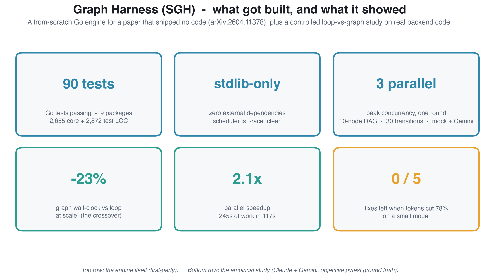

# Graph Harness (SGH)

A reference implementation of *From Agent Loops to Structured Graphs: A Scheduler-Theoretic Framework for LLM Agent Execution* ([arXiv:2604.11378](https://arxiv.org/abs/2604.11378)) - the "graphs over loops for agents" paper.

The paper is a position paper with **no code**. This project builds the engine it specifies: a controllable DAG execution engine for LLM agents (deterministic ready-set scheduler, immutable plan versions, contract validation, a 3-level recovery protocol), then runs the paper's own seven-group ablation to test whether graph execution actually beats agent loops.

## Paper and results

Read the write-up: **[Google Doc](https://docs.google.com/document/d/1ee5HSN4o8sQHyAmq7TmG6cXpMw7EOprR9C70LzxkFWU/edit?usp=sharing)** · **[typeset PDF](writeup/paper.pdf)** · [arXiv source paper](https://arxiv.org/abs/2604.11378)



Headline finding: graphs beat loops in wall-clock once a task is big enough to amortize their fixed overhead (a 23% win at scale, from a measured 2.1x parallel speedup), at a standing 2-3x token cost. On a small model, trimming context to cut that cost is capability-gated: -78% tokens dropped correctness from 5/5 to 0/5. All figures and method: **[showcase/SHOWCASE.md](showcase/SHOWCASE.md)**.

## Status

**The engine is built and runs end-to-end.** ~2,655 lines of Go + ~2,872 lines of tests (90 test
functions) across 9 packages, stdlib-only. The single-writer scheduler is `-race` clean. It runs a plan
(a DAG of nodes) to completion - in parallel where the graph allows - with `all_of`/`any_of` joins,
output-contract validation, a bounded 3-level recovery protocol, and an append-only write-ahead log.

```bash
cd engine
go build ./... && go test ./...                              # all green
go run ./cmd/sgh run examples/bugfix.json --provider mock    # deterministic, no network
GEMINI_API_KEY=... go run ./cmd/sgh run examples/bugfix.json --provider gemini   # real LLM nodes
```

Both provider scenarios are proven on the paper's 10-node bug-fix DAG: every node reaches a terminal
state, one `any_of` loser is skipped, peak parallelism |U|=3.

## Layout

```
paper/    the source paper (PDF)
spike/    M0 feasibility probe (Go) - validated Claude CLI + Gemini API as completion nodes
engine/   the SGH engine in Go (DONE) - see engine/AGENTS.md and engine/ENGINE_SPEC.md
  plan contract provider node validate wal recovery scheduler  + cmd/sgh + examples
eval/     Gemini per-node/per-iteration latency analysis
experiments/outreach-bugfix/   empirical study: loop vs graph + cost levers on real code
docs/     PAPER_EXPLAINED framing + first-principles (OS/MoE/BDH) + diagrams
```

See `engine/AGENTS.md` to work in the engine, `PROJECT_PLAN.md` for the plan and locked decisions, and
`PAPER_EXPLAINED.md` for a plain-English breakdown of the paper.
