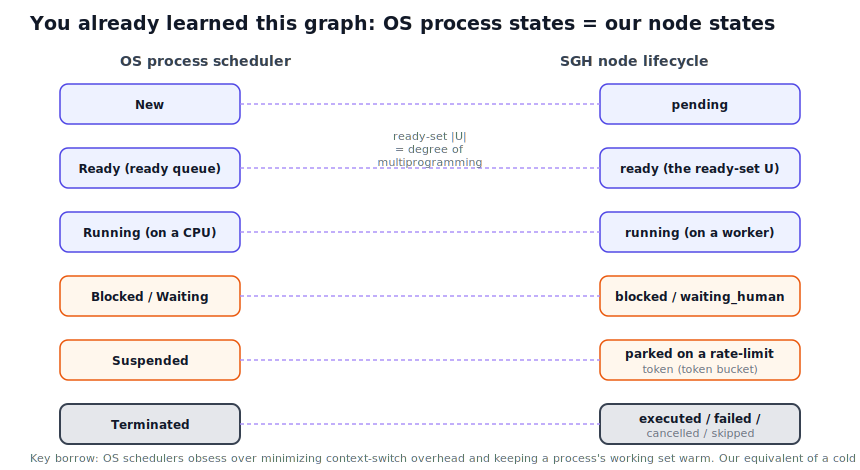

# Scheduling from first principles: OS, models, and SGH

> Why the graph cost 3x the tokens in our pilot, and how to fix it - reasoned from fundamentals,
> not from tricks. Companion to [`../experiments/outreach-bugfix/REPORT.md`](../experiments/outreach-bugfix/REPORT.md).

## 1. The one principle, at three scales

"Run it as a graph instead of a loop" is not a new idea - it is the oldest idea in computing systems,
showing up at every level. The principle:

> **Represent the work as a graph, spend compute only on the part that matters, and run independent parts at the same time.**

Three places you have already seen it:

| Scale | The "scheduler" | The graph | "Fire only what matters" |
|-------|-----------------|-----------|--------------------------|
| **Operating system** | the process scheduler | the process state diagram + the ready queue | only runnable processes sit in the ready queue; blocked ones wait |
| **Inside the model** | the router (Mixture-of-Experts), or in the "Dragon Hatchling / BDH" view, the neuron graph | a sparse graph of experts/neurons | each token activates only a few experts / neurons fire sparsely |
| **Our SGH engine** | the ready-set scheduler | the task DAG | only ready nodes run; `any_of` skips losers; dead branches are pruned |

So "graphs over loops" (task level) is the same move as "sparse activation over dense" (neuron level,
MoE / BDH) and "a real scheduler over run-everything-in-order" (OS level). The paper frames SGH as
scheduler theory on purpose - we are just naming the family it belongs to.

## 2. Borrowing from the OS scheduler (the part you already learned)

Our node lifecycle is, almost line for line, the OS process-state diagram:

| OS concept | SGH equivalent | What it teaches us |
|------------|----------------|--------------------|
| Ready queue | the ready-set `U` | the set of work that *can* run now |
| Degree of multiprogramming | `\|U\|` (how many run at once) | the thing the graph raises above 1 |
| Blocked / Waiting (on I/O) | `blocked`, `waiting_human` | a node parked until a dependency or human responds |
| Suspended (swapped out) | parked on a rate-limit token | the token-bucket throttle is a resource the scheduler waits on |
| **Context-switch overhead** | **each agent re-reading the task + files** | **this is the 3x token cost** - the OS lesson is: minimize it |
| Keeping the working set warm (cache locality) | **prompt / KV caching** | reuse the shared prefix instead of reloading it every call |
| Non-preemptive scheduling | LLM calls run to completion | an in-flight call is expensive/unsafe to kill -> why `any_of` is our only "preemption" and `first_of` is excluded |

The headline insight from this lens: **the graph's extra cost is exactly "context-switch overhead."**
The OS solves that by not reloading a process's working set on every switch. Our equivalent is to stop
making every agent re-read everything from scratch.

## 3. Borrowing from the model's own sparsity (MoE / BDH)

State-of-the-art models are not dense black boxes that think with all their weights on every token.
Mixture-of-Experts models **route** each token to a few experts; the rest stay dark. The recent
*Dragon Hatchling (BDH)* line of work goes further, modelling reasoning as a **sparse graph of neurons
where only the relevant ones fire** (a bridge between the Transformer and brain-like local dynamics).
We do not control or implement any of that - but it tells us something useful:

> The model already wins by being sparse and graph-structured internally. We should mirror that at the
> orchestration level: a sparse task-graph where we only "fire" (spend tokens on) the nodes that matter.

Concretely, "fire only what matters" at our level means: don't run nodes whose result won't change the
outcome, don't feed a node tokens it doesn't need, and don't use a big model where a small one fires fine.

## 4. The optimized graph arm (G'), derived from the above

Each lever below comes straight from a principle in sections 2-3. Applied to the pilot's graph arm
(146.9k tokens, 113s), these are the things that should cut the cost:

| # | Lever | Principle it comes from | Expected effect |
|---|-------|-------------------------|-----------------|
| 1 | **Deterministic verify** - run `pytest`, delete the LLM "verify" agent | sparsity: don't use a model where a free, exact check works | removes one whole agent's tokens; also more reliable |
| 2 | **Prompt-cache the shared prefix** across the two parallel fix nodes | OS: keep the working set warm (cache locality) | the big shared context (task + files + analysis) is paid for ~once, not per node; cached input ~10% price |
| 3 | **Scope each node's context** to only its inputs, not the whole repo dump | sparsity + OS working-set: smaller resident set | shrinks every call; attention cost grows with length, so this compounds |
| 4 | **Right-size the model per node** - small/fast model for planner, big model only for the hard fix | MoE routing: send easy work to a cheap expert | planner/extraction tokens get much cheaper |
| 5 | **Dual-path guard** - if the planner finds < 2 independent subtasks, fall back to the loop | OS: don't multiprogram a single job | stop paying graph overhead when there is nothing to parallelize (the pilot's exact situation) |

**Prediction (to measure, not promise):** levers 1-3 alone should move the graph from ~147k tokens toward
the loop's neighbourhood (~60-80k) while keeping the parallelism and the smaller, cleaner diff. We will
report **cached vs uncached input tokens** so the caching win is quantified, not asserted.

## 5. Honest boundaries

- We call Claude/Gemini as a hosted service. We do **not** modify weights, kernels, or attention. So
  "optimize the transformer" means optimize **how we feed it tokens and structure calls** - not the model.
- BDH is an emerging research model; we borrow its *principle* (sparse, graph-structured firing), we do
  not implement it.
- The numbers above are hypotheses. The point of arm G' is to measure them.

## 6. How we'll measure it cleanly

The Claude sub-agent experiment is realistic but hard to instrument for caching (the orchestration
hides per-call knobs). So we demonstrate the cost mechanics on the **controllable Gemini-API harness**
(`../eval/`), where token counts are exact and we control caching/scoping directly - then carry the
two robust, provider-agnostic levers (deterministic verify, context scoping) back to the Claude
experiment. Result: **loop vs naive-graph vs optimized-graph (G')**, with each lever's contribution isolated.
