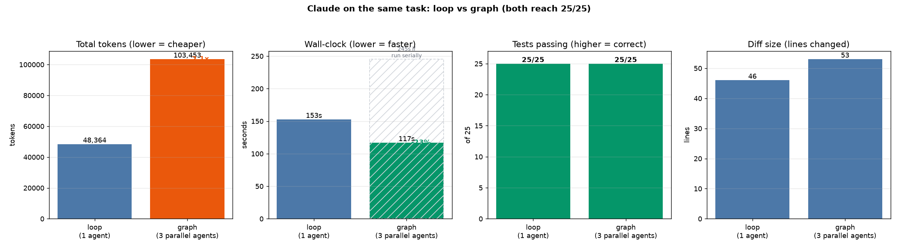

# Claude: loop vs graph on a real hardening task

**Question (from the paper):** for a verifiable engineering task, does running the work as a planned
**graph** of parallel agents beat running it as a single **loop** agent - and at what cost?

**This run:** fix the production hardening + bugfix task on the real `outreach-proj` backend
([`TASK_HARDENING.md`](TASK_HARDENING.md)), with both arms using Claude sub-agents from an identical
start, judged by one objective command.

- **Ground truth:** `pytest -q` must go from `7 failed, 18 passed` (baseline) to `25 passed`, no regressions.
- **Arm L (loop):** one Claude agent, free to edit anything under `app/`, iterating on pytest.
- **Arm G (graph):** the work split into 3 independent nodes (disjoint file-sets) run **in parallel**,
  then a single deterministic `pytest` verify.
- No mocks of the agents; each arm ran on its own `rsync` copy of the baseline. Tokens, tool calls, and
  wall-clock come from the agent harness's own usage metrics (so token counts here are real, not estimated).

## Result: both correct; the graph traded 2.1x tokens for 23% less wall-clock

| Metric | Loop | Graph | Who wins |
|--------|-----:|------:|----------|
| Ground truth | **25 passed** | **25 passed** | tie (both correct) |
| Agents | 1 | 3 (parallel) | loop (less overhead) |
| Tokens | 48,364 | 103,453 | loop (graph **2.1x**) |
| Wall-clock | 152.6s | **116.8s** | **graph (-23%)** |
| Wall-clock if run serially | - | 245.2s | - |
| Tool calls | 22 | 29 | loop |
| pytest iterations | 3 | per-node | - |
| Diff size | 46 lines (+36/-10) | 53 lines (+42/-11) | ~tie |
| Files changed | 5 | 5 | tie |

### The graph's three nodes (what ran in parallel)

| Node | Files edited | Tokens | Wall-clock | Result |
|------|--------------|-------:|-----------:|--------|
| validation | `app/schemas/chat.py` | 28,232 | 64.0s | its 2 tests pass |
| pagination | `app/api/v1/campaigns.py`, `app/repositories/campaign_repository.py` | 32,543 | 64.4s | its 2 tests pass |
| chat correctness | `app/api/v1/chat.py`, `app/services/chat_service.py` | 42,678 | 116.8s | its 3 tests pass |
| **verify** | (deterministic `pytest`) | 0 | ~2s | **25/25** |

The graph's wall-clock (116.8s) equals its **slowest node** (chat correctness), not the sum (245.2s) -
that gap is the parallelism payoff. The chat-correctness node was the bottleneck because it owned two
coupled files and three fixes (the IDOR 404 check, the `finalize_session` arity bug, and the missing
initial chat message); the other two nodes finished in ~64s and then sat idle.

## What it means

**The graph still costs more tokens, but the time cost has flipped versus the tiny pilot.**

- **Tokens (graph loses, 2.1x):** each node re-reads its own slice of context independently, and there is
  no sharing across the parallel branches. That duplicated context is the "orchestration tax." It is real
  and it scales with the number of nodes.
- **Wall-clock (graph wins, -23%):** three nodes ran at once, so the arm finished when the slowest node
  did (117s) instead of after a serial chain (the loop's 153s). In the earlier 2-bug pilot the graph was
  *slower* because there was not enough independent work to amortize the overhead. On this larger task the
  graph crosses over and wins on time - exactly the prediction the pilot set up.
- **Correctness (tie):** both arms reached 25/25. Claude is capable enough that splitting the work across
  scoped sub-agents did not cost correctness - contrast the cheap-model cost experiment
  ([`GEMINI_LEVERS_REPORT.md`](GEMINI_LEVERS_REPORT.md)), where scoping broke correctness.
- **Diff (tie):** 46 vs 53 lines - comparable. (In the pilot the graph produced a notably smaller diff;
  here both arms made similar, surgical changes.)

**Takeaway:** graph-vs-loop is a task-size-dependent trade - pay more tokens, buy wall-clock, and only
worth it when the task has enough independent work to parallelize. The design that follows is **dual-path**:
route trivial tasks to a loop, parallel-heavy tasks to the graph. The one free, always-on lever is the
deterministic `pytest` verify (no LLM "is it correct?" call).

## Method notes and caveats

- **N = 1 per arm**, single task; LLM output is non-deterministic, and sub-agent wall-clock includes
  scheduling/queue noise. Directional signal, not a benchmark.
- **The graph's planner step was provided** (I supplied the 3-node, disjoint-file decomposition rather than
  spawning a planner agent), so the graph's measured token cost is execution-only - a real planner call
  would push it a bit higher. This slightly *favors* the graph.
- **Concurrent-edit blip:** while the pagination node was mid-edit, the validation node briefly saw a
  `NameError: Query` when it ran its own pytest. This is the expected hazard of parallel agents sharing one
  working copy; it is transient, and the **final `pytest` verify after all nodes finished is authoritative**
  (25/25). Disjoint file-sets meant no edit actually clobbered another.
- **Loop and graph ran separately** (not concurrently) so they did not compete for the API and skew each
  other's wall-clock.

## Artifacts
- `runs/claude_arms.json` - full metrics (loop, graph, per-node)
- `plots/claude_loop_vs_graph.{png,svg}` - the chart above
- `plot_claude.py` - regenerates the chart from the JSON
- Combined cross-experiment synthesis: [`SIDE_BY_SIDE.md`](SIDE_BY_SIDE.md)
