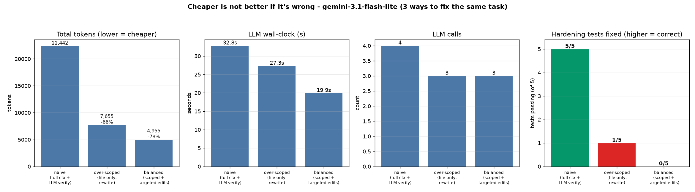

# Cutting the graph's cost (gemini-3.1-flash-lite)

**Question:** the pilot showed the graph costs ~3x the tokens. Can the transformer-informed levers
(context scoping, deterministic verify, targeted edits) cut that - and at what cost to correctness?
Levers come from [`../../docs/SCHEDULING_FIRST_PRINCIPLES.md`](../../docs/SCHEDULING_FIRST_PRINCIPLES.md).

**Setup:** fix the 3 single-file hardening items (5 tests) on the real `outreach-proj` code with
`gemini-3.1-flash-lite`, three ways. Correctness is `pytest` (objective). Tokens are exact (from the API).

| Arm | How each fix node works | Verify |
|-----|-------------------------|--------|
| **naive** | sent the WHOLE repo context, rewrites the whole file; + an LLM "verify" node | LLM node + pytest |
| **over-scoped** | sent ONLY its file + its tests, rewrites the whole file | pytest |
| **balanced** | sent the SAME scoped context, but returns small targeted edits (no whole-file rewrite) | pytest |

## Result: cheaper, but correctness collapsed

| Metric | naive | over-scoped | balanced |
|--------|------:|------------:|---------:|
| Total tokens | 22,442 | 7,655 (**-66%**) | 4,955 (**-78%**) |
| LLM calls | 4 | 3 | 3 |
| Wall-clock | 32.8s | 27.3s | 19.9s |
| **Hardening tests fixed** | **5 / 5** | 1 / 5 | 0 / 5 |



## The honest reading (my "balanced wins" hypothesis was wrong)

I expected the balanced arm (targeted edits) to be cheap AND correct. It was the cheapest and the **least**
correct. But a direct diagnostic on the schema fix showed the targeted-edit machinery is **not** broken -
in isolation, flash-lite produced exactly the right edit and the tests passed:

```
edits: [ {"old":"from pydantic import BaseModel","new":"from pydantic import BaseModel, Field"},
         {"old":"message: str","new":"message: str = Field(..., min_length=1, max_length=4000)"} ]
-> 3 passed
```

So the cheap arms are not *broken*, they are **high-variance**: the same approach that nails a fix in
isolation flubs it inside a full run. Three takeaways:

1. **Deterministic verify is a free, safe win.** Replacing the LLM "verify" node with `pytest` removed a
   whole call with zero downside. Always on, regardless of model.

2. **With a small model, you cannot cheaply cut context on this task.** The only arm that was reliably
   correct (5/5) was the expensive one that fed every node the full context and let it rewrite the whole
   file. Scoping and tiny edits made it cheaper but flaky/wrong. For `flash-lite`, **context is what buys
   correctness** here.

3. **The cost-correctness frontier is gated by model capability.** A weak model needs lots of context to
   be right; a stronger model should stay correct on far less. That is exactly the "use a strong model,
   harnessed well" intuition - and it is testable. The companion **Claude experiment** runs the same task
   to see whether a stronger model gets cheap AND correct where flash-lite could not.

## Caveats (don't over-read this)

- **N = 1 per arm**, single task, and LLM output is non-deterministic - run-to-run variance is large
  (the diagnostic vs the full run proves it). These are directional signals, not a benchmark.
- Whole-file rewrite by a small model is itself risky (it drops what it can't see); targeted edits reduce
  that risk but flash-lite did not place them reliably in the full run.

## Next

The Claude loop-vs-graph experiment on the same task (running now) is the stronger-model counterpart. Then
a combined side-by-side: cheap-model levers vs strong-model agents on one identical, objective task.

Artifacts: `gemini_levers.py`, `runs/gemini_levers.json`, `plots/gemini_levers.{png,svg}`, `test_hardening.py`.
