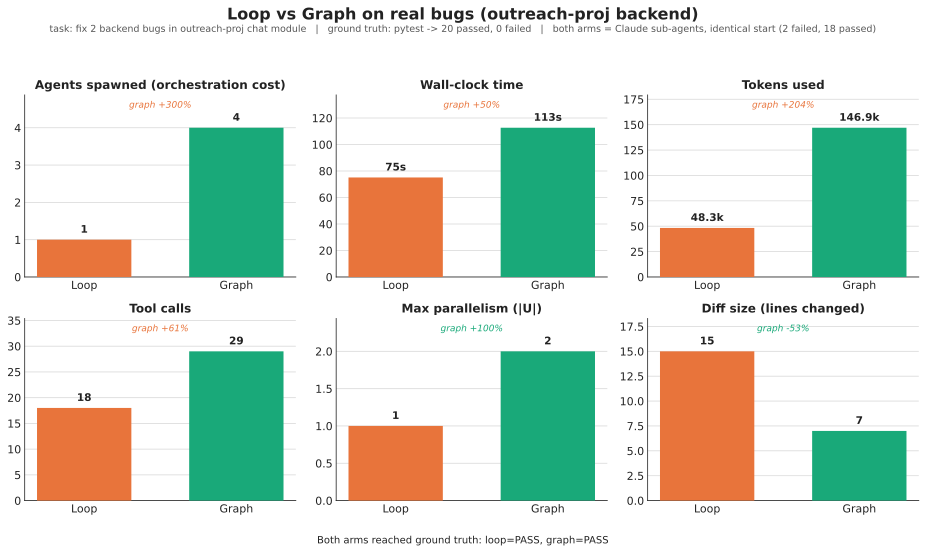
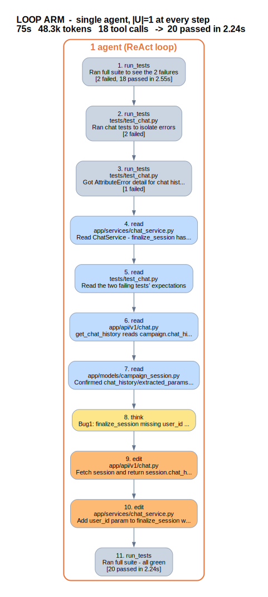
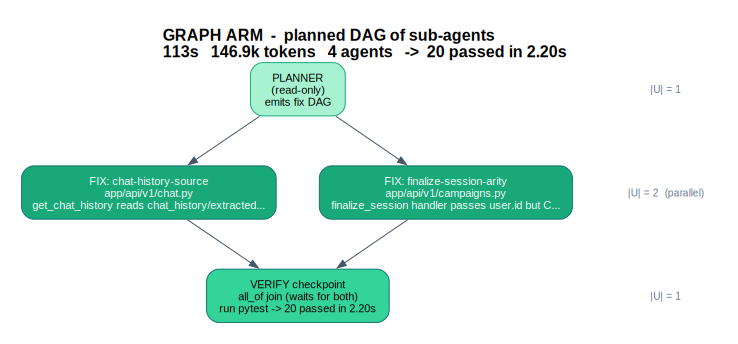

# Loop vs Graph on real bugs - pilot report

**Question (from the paper):** for a verifiable engineering task, does running the work as a
**planned graph** beat running it as a **loop**?

**This pilot:** fix 2 real bugs in `outreach-proj`'s backend chat module, with both arms using
Claude sub-agents, from an identical start, judged by one objective command.

- **Ground truth:** `pytest -q` must go from `2 failed, 18 passed` (baseline) to `20 passed` with no new failures.
- **Arm L (loop):** one Claude agent, ReAct style.
- **Arm G (graph):** Claude orchestrated as a planned DAG of sub-agents (planner -> 2 parallel fix nodes -> verify).
- No mocks. Original project untouched (we ran on git worktrees of a copy; fixes left uncommitted).

> Note on scope: Arm G's executor here is Claude's workflow/sub-agent orchestration, not our Go
> SGH engine (which is at M0). This tests the paper's *idea* on real agents + real code. N=1 task,
> 2 bugs - an honest pilot, not the paper's full study. Sub-agent wall-clock is inherently noisy.

## Result: both fixed it; the graph was more expensive but more surgical

| Metric | Loop | Graph | Who wins |
|--------|-----:|------:|----------|
| Ground truth | **20 passed** | **20 passed** | tie (both correct) |
| Agents spawned | 1 | 4 | loop (less overhead) |
| Wall-clock | 75 s | 113 s | loop (+50% for graph) |
| Tokens | 48.3k | 146.9k | loop (graph +204%) |
| Tool calls | 18 | 29 | loop |
| Max parallelism `|U|` | 1 | 2 | **graph** |
| Diff size | 15 lines (+11/-4) | **7 lines (+4/-3)** | **graph** (smaller blast radius) |
| Recovery rounds | 0 | 0 | tie |

### The two structures (what actually ran)

| Loop arm | Graph arm |
|----------|-----------|
|  |  |

The loop is a strictly sequential 11-step chain (`|U|=1` throughout). The graph planned two
independent fix nodes that ran in parallel (`|U|=2`), joined by a single `all_of` verify checkpoint
(`|U|=1`). Exact prompts and the planner's DAG: see [`PROMPTS.md`](PROMPTS.md).

## What it means

**The graph lost on efficiency and won on structure - exactly as the paper predicts for small tasks.**

- For a 2-bug task, the graph's orchestration overhead (a planner agent + a verify agent + 4 agents
  total, each re-reading context) cost ~3x the tokens and ~1.5x the wall-clock. The 2-way parallelism
  could not amortize that overhead at this tiny scale. This is the paper's **fixed-overhead hypothesis
  (H4)** confirmed on real code, and it validates the **dual-path** idea: route trivial tasks to a
  loop, complex ones to the graph.
- The graph still showed its structural advantages: it ran the two fixes **in parallel**, produced a
  **smaller, cleaner diff** (7 vs 15 lines - its planner deliberately chose the minimal call-site fix
  for bug 1, while the loop changed a method signature and bolted on an ownership check), and is fully
  **auditable** (an explicit DAG with a guaranteed dependency at the verify checkpoint).
- Crucially, this is a case where the graph **should** lose on cost - which is what makes the
  comparison honest rather than rigged.

**The prediction this sets up:** the loop's cost grows ~linearly with the number of sequential
turns, while the graph's critical path stays short as independent work fans out and the fixed
planner/verify overhead amortizes. So the graph should overtake the loop on wall-clock once the task
has enough independent sub-tasks. **Next experiment: scale the bug set (6-10 independent bugs)** and
find the crossover point.

## Artifacts
- `runs/baseline.txt`, `runs/arm_loop.json`, `runs/arm_graph.json`, `runs/metrics.json`
- `runs/arm_loop.diff`, `runs/arm_graph.diff` (the actual code changes each arm made)
- `plots/loop_vs_graph.{svg,png}`
- `diagrams/loop-arm.{svg,png}`, `diagrams/graph-arm.{svg,png}`
- `plot_compare.py`, `make_diagrams.py` (regenerate everything from the run logs)
