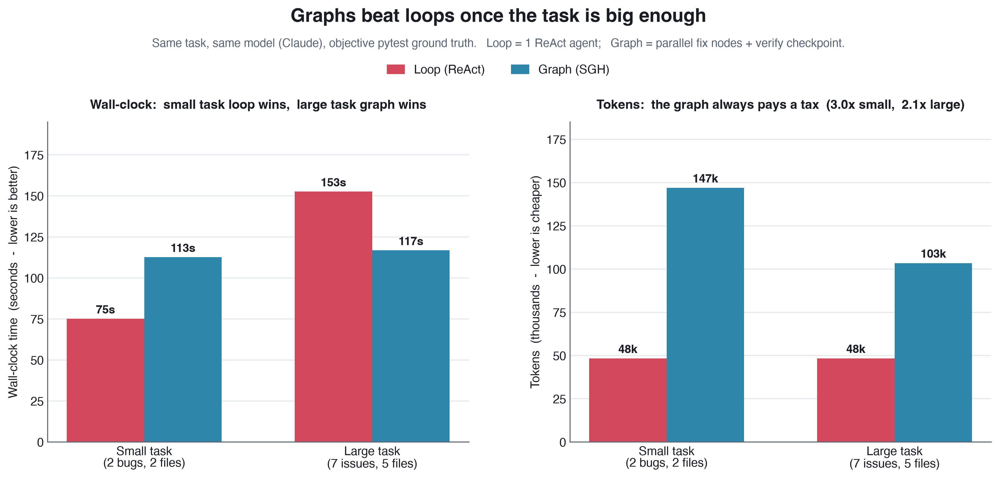
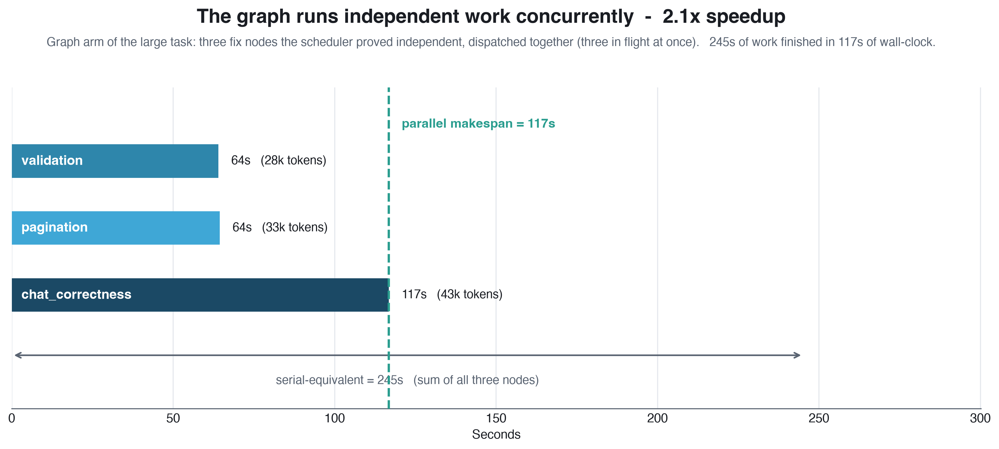
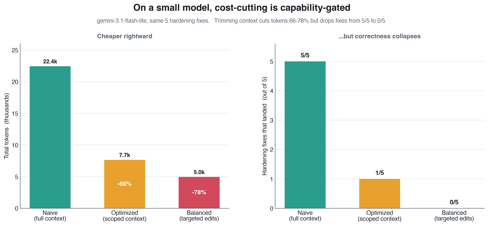
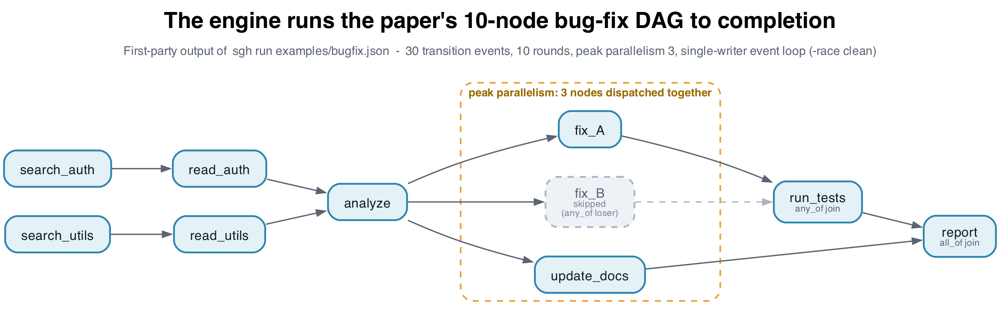

# Graph Harness (SGH) - Results & Visuals

A from-scratch **Go execution engine** for a position paper that shipped *no code*
([arXiv:2604.11378](https://arxiv.org/abs/2604.11378), "graphs over loops for agents"),
plus a **controlled empirical study** asking the paper's open question on real backend code:
*does running an agent as a graph actually beat running it as a loop?*

Every number on every chart below is read from a real run file in
[`../experiments/outreach-bugfix/runs/`](../experiments/outreach-bugfix/runs/) or captured
from the engine's own transition trace. Nothing is illustrative. The source file is named in
each caption.

---

## At a glance


| | Metric | Source |
|---|---|---|
| **Engine** | 9 packages, 2,655 core + 2,872 test LOC, 90 tests, stdlib-only, scheduler `-race` clean | `go test ./...` |
| **Engine** | Runs the paper's 10-node DAG: 30 transitions, 10 rounds, peak 3-wide parallelism, on mock **and** real Gemini | `sgh run examples/bugfix.json` |
| **Result 1** | Graph is **23% faster** wall-clock than a loop *once the task is large enough* (the crossover) | `runs/claude_arms.json` |
| **Result 2** | That speedup comes from **2.1x parallelism** - 245s of work done in 117s | `runs/claude_arms.json` |
| **Result 3** | On a small model, cutting tokens 78% drops correctness from **5/5 to 0/5** - cost-cutting is capability-gated | `runs/gemini_levers.json` |

---

## 1. The headline: graphs beat loops once the task is big enough



The same task is solved two ways - a single ReAct **loop** agent, and a **graph** of parallel
fix-nodes plus a verify checkpoint - with the *same model* (Claude) and an *objective* pass/fail
oracle (`pytest`, not an LLM judge). Run at two scales:

- **Small task** (2 bugs, 2 files): the loop wins. The graph's planning/orchestration overhead is
  fixed cost that a tiny task can't amortize - it's **50% slower**.
- **Large task** (7 issues, 5 files): the graph wins wall-clock by **23%**. This is the *crossover*
  the paper predicts (its fixed-overhead hypothesis, H4): parallelism only pays once there's enough
  independent work to parallelize.

The right panel is the honest cost: **the graph always pays a token tax** (3.0x on the small task,
2.1x on the large one). The trade is tokens-for-latency, and it only makes sense above the crossover.

> **Read this honestly:** this is a controlled A/B at *two* task scales, not a smooth many-point
> curve. It establishes direction and a crossover, not a precise threshold. Source: `runs/metrics.json`
> (small) and `runs/claude_arms.json` (large).

## 2. Where the speedup comes from



Inside the large-task graph run: the scheduler proved three fix-nodes independent and dispatched them
together. The bars are the **real measured durations** of each node. Summed, that's 245s of work; run
concurrently, it finished in a **117s makespan** - a **2.1x speedup**. This is the engine's core idea
made visible: the ready-set holds every node whose dependencies are met, and they all run at once.
Source: `runs/claude_arms.json`.

## 3. The non-obvious result: cheap is not free



A separate study on a **small** model (`gemini-3.1-flash-lite`), same 5 hardening fixes, varying how
much context each node receives. Trimming context is the obvious way to cut the graph's token tax -
and it works, cutting tokens 66-78%. But on a weak model the correctness **collapses to 0/5**. The
lesson worth putting on a slide: *context-scoping as a cost lever is capability-gated* - it's safe on a
strong model and dangerous on a weak one. The one lever that's always free is the deterministic verify
(`pytest`), because it costs no tokens and never hallucinates a pass. Source: `runs/gemini_levers.json`.

## 4. The engine itself runs all of this



This is the engine's **own output**, not a mock-up: `sgh run examples/bugfix.json` executes the paper's
10-node bug-fix DAG to a terminal state. The layout is the real dependency structure (rendered by
Graphviz). `fix_B` is greyed because `run_tests` uses an **`any_of` join** - the first fix to pass wins,
and the loser is skipped, exactly as the scheduler decided at runtime. The amber band is the
peak-parallelism layer: three nodes the single-writer event loop dispatched in the same round.

---

## Reproduce

```bash
# the engine (deterministic, no network)
cd ../engine && go test ./... && go run ./cmd/sgh run examples/bugfix.json --provider mock

# the charts (reads the same run files this doc cites)
cd ../showcase
/opt/homebrew/Caskroom/miniforge/base/bin/python3 make_figures.py   # figs 1,2,3,5
dot -Tpng -Gdpi=200 engine_dag.dot -o fig4_engine_dag.png           # fig 4
```

## What this is and isn't

- **Is:** a working reference implementation of a code-free paper, and a controlled measurement that
  reproduces its central prediction (the loop/graph crossover) on real code with an objective oracle.
- **Isn't:** a benchmark suite. Two task scales, a handful of runs each. The findings are directional
  and honestly scoped - which is the point: they survive scrutiny because the numbers are real and the
  oracle is deterministic.
